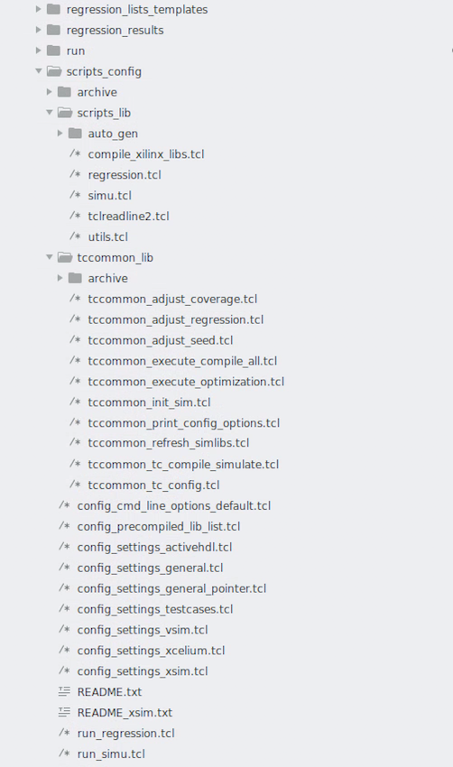

# Architecture

## Scripts folder structure

The TCL scripts are located in the scrpts_config folder as described below:

### scripts_config/tccommon_lib

None of the scripts in this folder should be called directly. 

This folder contains all scripts executed during the run of a test-case (TC). All these scripts are called only from the test-case script.

### scripts_config/scripts_lib

None of the scripts in this folder should be called directly, except the library compilation script in special cases.

There are three main scripts in this folder, which are at the heart of the simu scripts - the simu.tcl library script, the regression.tcl script and the utils.tcl library. The simu.tcl script is calling the other two scripts, and the TC[^1] execution TCL script is calling the simu.tcl script.

The tclreadline2.tcl script provides the user friendly experience keeping the history of the executed commands. It is very helpful when using the Linux tclsh TCL interpreter that lacks basic user friendliness. It is automatically called by the simu.tcl script.

The compile_xilinx_libs.tcl script is used to compile Xilinx libraries, but the same functionality can be done manually from the Vivado tool GUI. It can be used for scripting automation purposes if we don't want to use the tool GUI.

#### scripts_config/scripts_lib/auto_gen

In this folder is located cmd_line_options.tcl which is automatically generated and should not be changed manually because it will be overwritten. The script is generated from the config_cmd_line_option_defailt.tcl and in some cases takes into account with higher precedence the CLI passed arguments when the simu library is used to run test-case or regression simulations.

